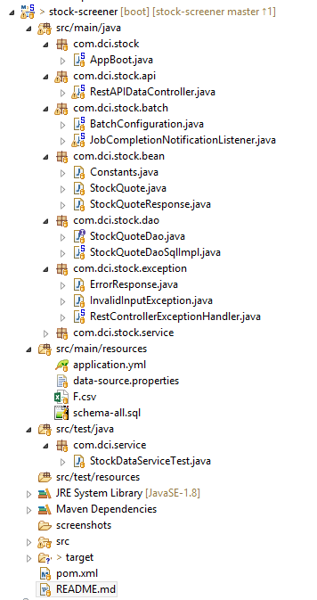

# Stock Screener Service

## Technologies Used

1. Java 8
2. Spring Boot 2.0.2
3. Maven 3.3
5. Tomcat 8.5
6. HSQLDB 2.4


## Project Structure




## Setup Steps

### Build the application

1. Prerequisite: Maven 3 and Java 8 are installed

2. Clone the repository onto a System

3. From the project root directory run the command ```$ mvn clean install``` and the artifact is produced as a jar file in ```<project_root>\target\stock-screener-0.0.1-SNAPSHOT.jar```

### Run the application

6. Goto the directory ```<project_root>\target\``` from the terminal and use the below command to start the application
 
```java -jar stock-screener-0.0.1-SNAPSHOT.jar --Spring.config.location=file:conf\data-source.properties```

7. Tomcat starts on port 8080 and the application can be accessed from the browser at http://localhost:8080/


## Using the Application

Once the application is running, the user should be able to go to the browser and type ```http://localhost:8080/login``` and the response should be **Login with OAuth 2.0**. To access all the API's , the client needs to log in to with GitHub credentials.

## API Specs

**API-1.0** 
URI: /api/data/{symbol}/close?startDate=<YYYY-MM-DD>&endDate=<YYYY-MM-DD>
Method: GET
Params: startDate and endDate in YYYY-MM-DD format
Response: List of [StockQuoteResponse](src/main/java/com/dci/stock/bean/StockQuoteResponse.java) in JSON or XML
Description: The API gets all closing prices from the given start and end date
Example: ```http://localhost:8080/api/data/F/close?startDate=2008-02-01&endDate=2008-12-31```

**API-2.0** 
URI: /api/data/{symbol}/avgclose
Method: GET
Response: List of [StockQuoteResponse](src/main/java/com/dci/stock/bean/StockQuoteResponse.java) in JSON or XML
Description: The API gets all average annual closing prices till today
Example: ```http://localhost:8080/api/data/F/avgclose/```

**API-2.1** 
URI: /api/data/{symbol}/avgclose/year/{year}
Method: GET
Response: List of [StockQuoteResponse](src/main/java/com/dci/stock/bean/StockQuoteResponse.java) in JSON or XML
Description: The API gets all average monthly closing prices for a given year
Example: ```http://localhost:8080/api/data/F/avgclose/year/1999```

**API-2.2** 
URI: /api/data/{symbol}/avgclose/year/{year}/month/{month}
Method: GET
Response: List of [StockQuoteResponse](src/main/java/com/dci/stock/bean/StockQuoteResponse.java) in JSON or XML
Description: The API gets all average monthly closing prices for a given year
Example: ```http://localhost:8080/api/data/F/avgclose/year/1999/month/3```


## Technology choice

The application loads the F.csv using Spring Batch into an in-memory HSQLDB. Reason for HSQLDB:
1. Small sized data for the csv
2. Easy relational style data
3. In-Memory DB for faster access
4. HSQLDB has easy integration with Spring Boot and Spring Batch

Other technologies that were evaluated were:
1. **Redis Cache**: Key value pair not suited for the use case, may use it in combination of RDBMS but not needed with HSQLDB.
2. **Apache Spark**: Although good for CSV batch process, but for the amount of data in hand it would be an overkill.

## Design

The application has the below parts:

1. Controller ```com.dci.stock.api```
A Rest based controller that redirects all HTTP requests from client into the Service layer

2. StockDataService ```com.dci.stock.service```
The business logic goes in here. Depending on the requests fetches the data from backend

3. Data Access Object ```com.dci.stock.service```
The DataAccess layer gets the close price and average close price based on date range

4. Batch ETL ```com.dci.stock.batch```
The ETL service to get the csv data loaded into HSQLDB using Spring Batch


## Improvements

Considering this is a proof of concept and time constraints, some stuff were overlooked and improvements are needed.

1. Proper handling if error/exception with more Exceptions etc

2. Add more JUnit & Integration test cases/suites

3. Swagger implementation for the API's

4. Paginate API-1.0 for close price

5. Externalize data-source.properties


